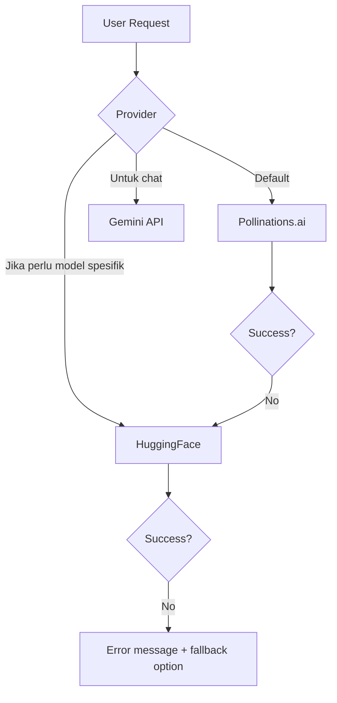

# Panduan Tetap Gratis Selamanya

## Prinsip Dasar

Mughis AI dirancang untuk **$0 operational cost** selama-lamanya dengan strategi berikut:

## 1. Zero Server Architecture

Tidak ada backend server = tidak ada biaya server.

```
Traditional App:      Browser → Backend Server → AI API ($)
Mughis AI:            Browser → AI API (FREE)
                      (no server = $0)
```

## 2. Static Hosting (Free Forever)

### Pilihan Hosting Gratis:

| Hosting | Bandwidth | Build | Domain Kustom |
|---|---|---|---|
| **Cloudflare Pages** | Unlimited | 500/bln | Ya (via CF) |
| **Vercel Hobby** | 100GB/bln | 6000/bln | Ya (via Vercel) |
| **GitHub Pages** | 100GB/bln | Unlimited | Ya |
| **Netlify Free** | 100GB/bln | 300 min/bln | Ya |
| **HuggingFace Spaces** | Limited | NA | Ya (subdomain) |

> **Rekomendasi: Cloudflare Pages** — bandwidth unlimited, build 500/bln cukup untuk update bulanan.

## 3. AI API Free Tiers — Yang Mana Bertahan?

### ✅ Pollinations.ai (Paling Recomended)
- **Model:** Custom FLUX-based
- **Limit:** Unlimited
- **API Key:** Tidak perlu
- **Kecepatan:** ~3-10 detik
- **Usia:** 2+ tahun (established)
- **Resiko:** Sangat rendah (service mature)

### ✅ Gemini API (Google)
- **Model:** Gemini 2.0 Flash
- **Limit:** 60 requests/menit (1,500/hari)
- **API Key:** Gratis di Google AI Studio
- **Kecepatan:** ~1-3 detik
- **Usia:** 2+ tahun
- **Resiko:** Rendah (Google backing)

### ✅ HuggingFace Inference API
- **Model:** 200k+ models (FLUX, SDXL, Whisper, dll)
- **Limit:** 30k input tokens/bln (free tier)
- **API Key:** Gratis di huggingface.co
- **Kecepatan:** ~5-30 detik (cold start)
- **Usia:** 4+ tahun
- **Resiko:** Rendah (established platform)

### ⚠️ Replicate (Removed)
- Dulu ada, sekarang dihapus karena kredit terbatas
- Kredit habis = bayar

## 4. Strategi Provider Fallback



## 5. Cost Projection (5 Tahun)

| Tahun | Hosting | AI APIs | Domain | Total |
|---|---|---|---|---|
| 1 | $0 | $0 | $0 | **$0** |
| 2 | $0 | $0 | $0 | **$0** |
| 3 | $0 | $0 | $0 | **$0** |
| 4 | $0 | $0 | $0 | **$0** |
| 5 | $0 | $0 | $0 | **$0** |

**Total 5 tahun: $0**

## 6. Jika Sesuatu Berubah

### Jika Pollinations.ai tutup:
→ Ganti default ke HuggingFace (gratis)
→ Atau tambah Replicate (kredit awal $5)

### Jika hosting gratis berubah:
→ Migrasi ke hosting gratis lain dalam 1 jam
→ Static site, zero dependency pada platform

### Jika ingin scale up:
→ Tambah backend (opsional, cost ~$5-10/bln)
→ Tambah storage (Supabase free tier: 500MB)
→ Tetap gratis untuk personal use

## 7. Fire-and-Forget Mode

Setelah deploy, Mughis AI bisa:
- **Dibiarkan saja** — tidak perlu maintenance rutin
- **Auto-update** — PWA update via browser
- **Data aman** — di localStorage, tidak kena server issue
- **No bills** — $0 forever

> "The best maintenance is no maintenance."

## Final Verdict

Mughis AI Personal Edition bisa berjalan **gratis selamanya** dengan:
1. Cloudflare Pages (hosting gratis unlimited)
2. Pollinations.ai (AI gambar gratis tanpa key)
3. Gemini API (chat gratis)
4. HuggingFace Inference (video & voice gratis)
5. Browser TTS (voice gratis offline)
